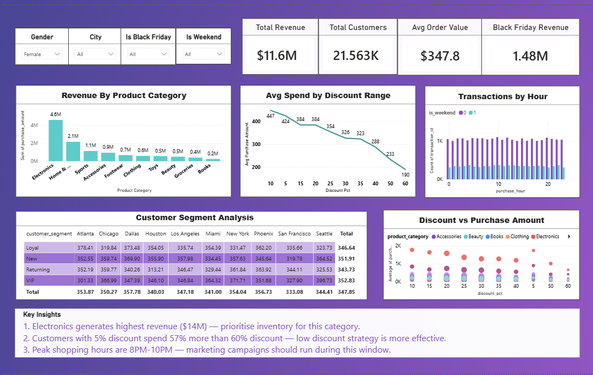

# Black Friday Sales Analysis 🛍️

## Table of Contents
- [Project Overview](#project-overview)
- [Dataset Description](#dataset-description)
- [Business Questions](#business-questions)
- [Key Findings](#key-findings)
- [Tools Used](#tools-used)
- [Recommendations](#recommendations)
- [Conclusion](#conclusion)

---

## Project Overview
Black Friday is one of the biggest shopping events 
globally. This project analyses 100,000+ Black Friday 
transactions to uncover customer behaviour patterns, 
revenue drivers, and discount effectiveness using 
Excel, MySQL, and Power BI.

---

## Dataset Description
- **Source:** Kaggle
- **Size:** [apni row count] transactions
- **Features:** 19 columns including:
  - Customer demographics — Age, Gender, City
  - Product info — Category, Price
  - Transaction details — Discount, Payment Method
  - Time data — Purchase Date, Hour, Weekend flag
  - **Target variable:** Purchase Amount

---

## Business Questions
1. Which product categories generate the most revenue?
2. Do bigger discounts lead to higher sales?
3. Which customer segments spend the most?
4. When do customers shop the most?
5. What factors drive purchase amount?

---

## Key Findings
- **Electronics** generates highest revenue at $14M — 
  40% of total revenue
- **Low discounts (5%)** drive highest avg spend ($448) 
  vs high discounts (60%) at only $193 — less is more
- **Loyal customers** show highest avg spend across 
  all cities
- **VIP segment** in New York shows highest avg spend 
  at $396
- Shopping pattern is **consistent throughout the day** 
  with slight evening peak

---

## Tools Used
| Tool | Purpose |
|------|---------|
| **Excel** | Data cleaning, null value treatment, feature engineering |
| **MySQL** | Data querying, aggregations, customer segmentation |
| **Power BI** | Interactive dashboard, KPI cards, data visualization |

---
## Dashboard Preview

---
## Recommendations
1. **Electronics First** — Highest ROI category, 
   prioritise inventory and marketing budget
2. **Revise Discount Strategy** — Low discounts drive 
   higher spend — avoid heavy discounting
3. **Target Loyal Segment** — Highest lifetime value, 
   focus retention campaigns here
4. **VIP + New York** — Highest avg spend combination, 
   ideal for premium product launches

---

## Conclusion
This analysis reveals that product category and discount 
strategy are the strongest drivers of revenue. 
Electronics dominates sales while lower discounts 
surprisingly drive higher spend per transaction. 
Loyal customers across all cities show consistent 
high-value behaviour, making them the most important 
segment for retention-focused marketing.
